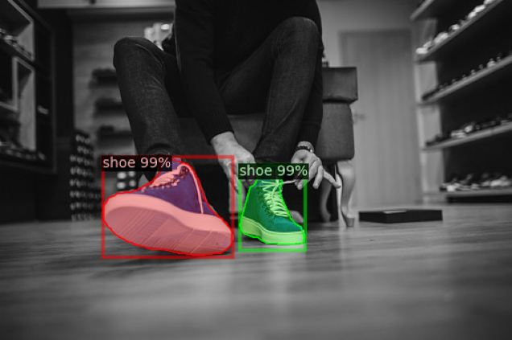
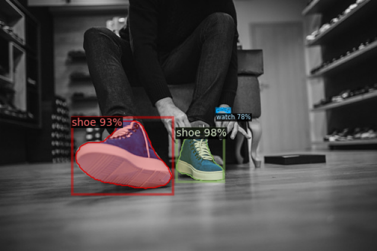
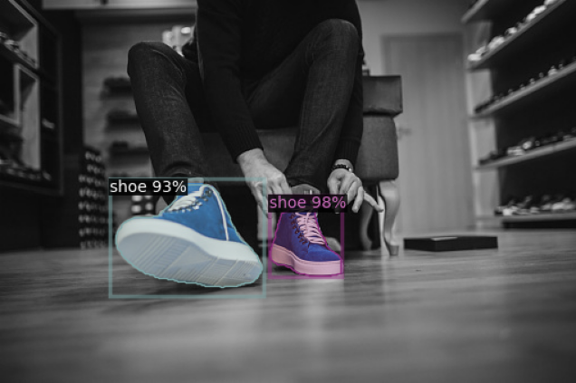
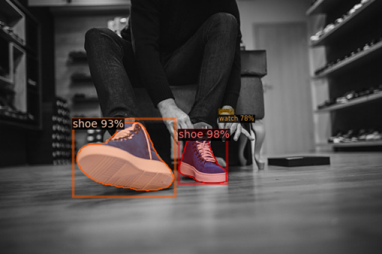
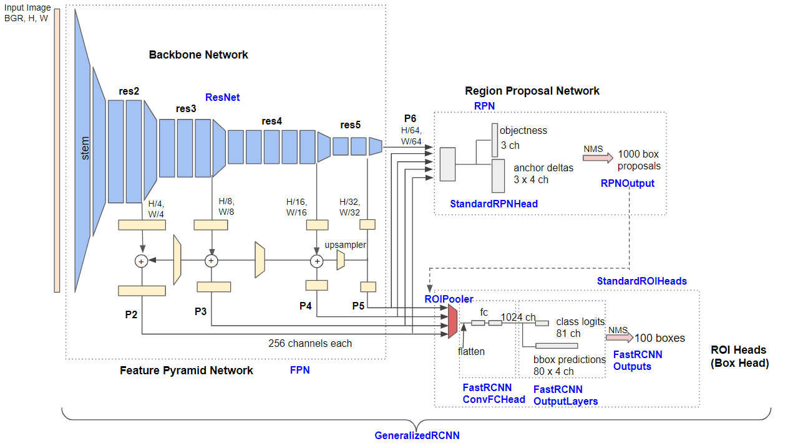

The following project was built on top of the <a href="https://ai.facebook.com/tools/detectron2/">FAIR's detectron2</a>.
The primary objective was to detect and segment very small objects in the image. To do that, we made some changes at the algorithm level and some at the data level.
<b>At data level</b>, we added a utility to slice the training images into 3x3 grid. This helps us retain the small objects in the image. Moreover, we get an enhanced region of interest. 
<b>At algorithm level</b>, using the Faster RCNN, we made several modifications:
1. Added a smaller anchor box (16px) and attached it to the early stage of the backbone network (ResNet-50).
2. Increased input resolution from 800 to 1280. We need to keep details in order to detect small objects.
3. Added <a href="https://github.com/obss/sahi">SAHI</a> at the inference. 

## Example dataset
<a href="https://www.kaggle.com/c/imaterialist-fashion-2020-fgvc7">iMaterialist (Fashion) 2020 at FGVC7 </a>
Fine-grained segmentation task for fashion and apparel

## Backbone Network
ResNet-50

### Analysis
Original Image

### Using different resolutions
| Low resolution (600px) | High resolution (960px) |
-------------------------|--------------------------
|  |  |
------------------------------------------------------------------------

### Using smaller anchor size with high resolution
| Without small anchor size | With small (16px) anchor size |
-------------------------|--------------------------
|  |  |

### ResNet backbone

